# 📱 Sook Waiting - 매장 운영 및 웨이팅 관리 앱

## 📌 프로젝트 소개
매장 운영을 효율적으로 관리하기 위한 안드로이드 애플리케이션입니다.  
웨이팅 관리, 고객 정보 관리, 매장 상태 관리 기능을 통해 실제 매장 환경에서 활용 가능한 서비스를 목표로 개발되었습니다.

---

## 🚀 주요 기능

### 🔹 사용자 관리
- Firebase Authentication 기반 회원가입 / 로그인 / 로그아웃

### 🔹 웨이팅 관리
- Firebase Realtime Database
- 고객 정보 입력 (이름, 전화번호, 인원 수)
- 웨이팅 접수 및 실시간 데이터 저장
- 웨이팅 목록 조회 (RecyclerView)
- 고객 호출 및 삭제 기능

### 🔹 매장 관리
- 테이블 상태 관리 (청소 / 단골 / 서비스 / 컴플레인)
- 상태에 따른 UI 시각화

### 🔹 물품 발주
- WebView 기반 물품 발주 기능
- 수량 조절 및 발주 처리

### 🔹 매출 관리
- 일주일 매출 입력
- 차트 기반 시각화

---

## 📸 Screenshots

<p align="center">
  
  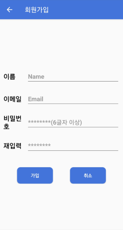
  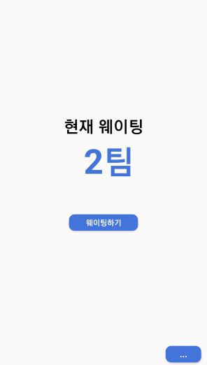
  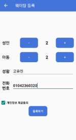
</p>

---

## 🛠 담당 역할

- Firebase Authentication 기반 로그인/회원가입 기능 구현  
- Firebase Realtime Database를 활용한 웨이팅 데이터 저장 및 관리  
- 웨이팅 접수 및 실시간 목록 관리 기능 개발  
- RecyclerView를 활용한 동적 리스트 구성 및 데이터 연동  
- 데이터 CRUD 처리 및 동기화 로직 구현  
- 사용자 입력 데이터 검증 및 예외 처리  

---

## ⚙️ 기술 스택

- Java
- Android SDK
- Firebase Authentication
- Firebase Realtime Database
- RecyclerView
- WebView

---

## 💡 핵심 구현 포인트

- Firebase 기반 실시간 데이터 동기화 처리
- 사용자 입력 → DB 저장 → UI 반영 흐름 설계
- RecyclerView를 활용한 동적 리스트 처리

---

## extra screenshots

<p align="center">
  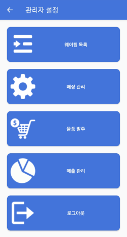
  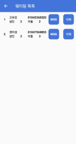
  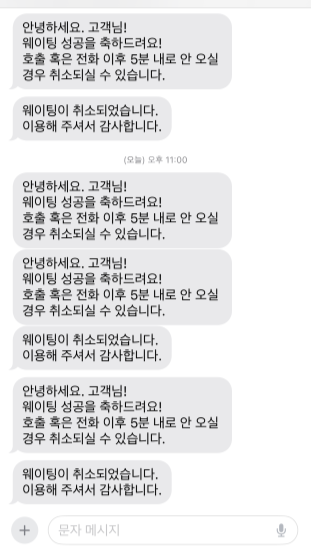
  
  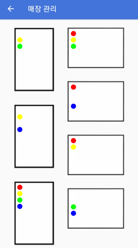
  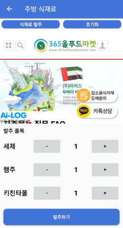
  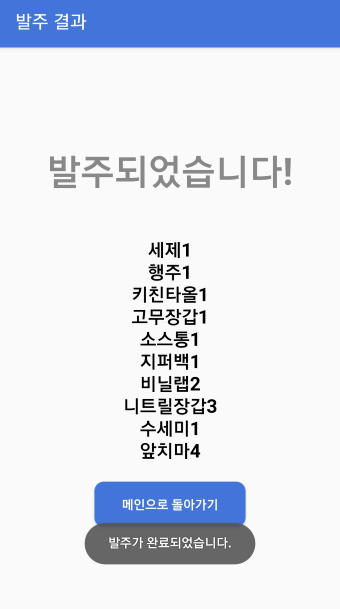
  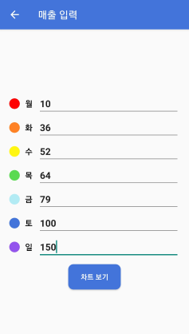
  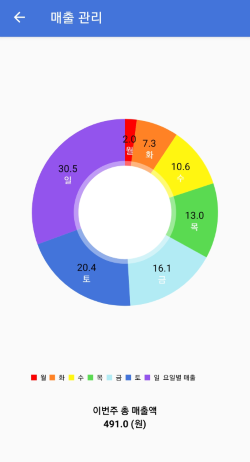
</p>

---

## 📌 실행 방법

1. 프로젝트 클론
```bash
git clone https://github.com/kwonmisung/android-waiting-app.git
